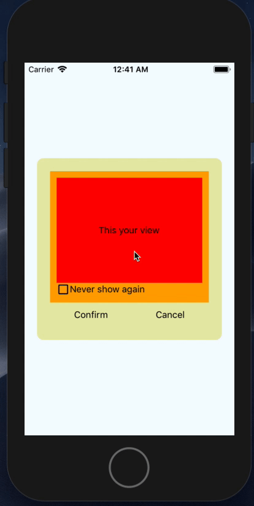

# react-native-hide-modal

[](https://github.com/heyman333/react-native-responsive-fontSize/pulls)
[](http://facebook.github.io/react-native/)
[](https://github.com/heyman333/react-native-responsive-fontSize/blob/master/LICENSE)

<strong>Modal component that provides the ability to hide</strong>

<hr />

## install

This library is based on the latest react-native version and uses the `react-native-community/async-storage`

Therefore, the following procedure is required to use this library.

1. link `react-native-community/async-storage` [Go to Guide](https://github.com/react-native-community/async-storage/tree/LEGACY#getting-started)

2. install node_moduels using npm or yarn
   ```shell
     npm install react-native-hide-modal --save
     #or
     yarn add react-native-hide-modal
   ```

## props

<table>
      <thead>
        <tr>
          <th></th>
          <th>type</th>
          <th>default</th>
          <th>required</th>
          <th>desc</th>
        </tr>
      </thead>
      <tbody>
        <tr>
          <th>children</th>
          <td>component</td>
          <td>undefined</td>
          <td align="center" width="80">✔️</td>
          <td>Your modal component with check option</td>
        </tr>
        <tr>
          <th>id</th>
          <td>string</td>
          <td>undefined</td>
          <td align="center" width="80">✔️</td>
          <td>It is used as a key value to distinguish the modal. And all key values must be unique <strong>(important)</strong></td>
        </tr>
        <tr>
          <th>modalProps</th>
          <td>object</td>
          <td>undefined</td>
          <td></td>
          <td>RN's modal property except for visible
            <br/>
            <a href="https://facebook.github.io/react-native/docs/modal#props-1" target="_blank">Official document</a>
          </td>
        </tr>
        <tr>
          <th>modalVisible</th>
          <td>boolean</td>
          <td>false</td>
          <td align="center" width="80">✔️</td>
          <td>Basically, determine if modal is visible or not</td>
        </tr>
        <tr>
          <th>hideChecked</th>
          <td>boolean</td>
          <td>false</td>
          <td align="center" width="80">✔️</td>
          <td>Indicates whether the user checked the checkbox.
Module does not work if the prop doesn't pass properly</td>
        </tr>
        <tr>
          <th>invisibleDuration</th>
          <td>number</td>
          <td>null</td>
          <td></td>
          <td>Assuming the data is set, decide how long to hide the modal. Modal is not visible permanently unless you pass the duration <i>(millisecond)</i></td>
        </tr>
      </tbody>
</table>

## screenshots




## examples

[Link](https://github.com/heyman333/react-native-hide-modal/blob/master/examples/App.js) (only code)

## author

[heyman333](https://github.com/heyman333), Frontend Developer interested in React.js & React-Native

## loadmap

- [ ] define index.d.ts file
- [ ] make react-hide-modal(web version using React.js)
- [ ] set circle ci
